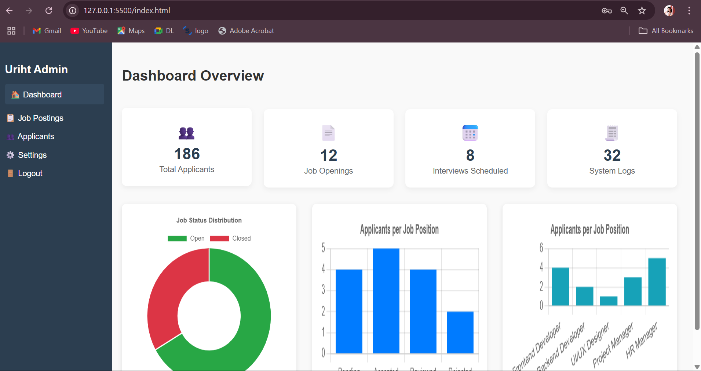

# Admin Dashboard with Authentication

A responsive and minimal Admin Dashboard built with **HTML**, **CSS**, and **JavaScript**, featuring basic login authentication and job management interface.




## 🔐 Demo Login (For Testing)

Use the following credentials to log in:

- **Email**: `admin@example.com`
- **Password**: `admin123`

These are hardcoded for front-end demo purposes.

---

## ✨ Features

### 🔐 Authentication
- Simple login form with email & password
- Toggle password visibility
- Form validation

### 📊 Dashboard
- Sidebar navigation: Dashboard, Job Postings, Applicants, Settings
- Job listing cards (with mock data)
- Modal-based "Add Job" form
- Search functionality

### 💡 UI/UX
- Responsive layout
- Clean, modern design
- User-friendly modal and navigation

---

## 📁 Folder Structure
admin-dashboard-ui/
│
├── assets/ # Logo and images
│ └── uriht.png
│
├── css/ # Stylesheets
│ ├── global.css
│ ├── login.css
│ └── dashboard.css
│
├── js/ # JS files
│ ├── auth.js
│ └── jobs.js
│
├── screenshots/ # Screenshots for demo
│ ├── login.png
│ └── dashboard.png
│
├── login.html # Login page
├── dashboard.html # Admin home page
├── applicants.html # Applicant management UI
├── settings.html # Settings page (placeholder)
└── README.md # You're here!

---

## 🚀 Getting Started

You can clone this project and run it locally:

```bash
git clone https://github.com/your-username/admin-dashboard-auth-ui.git
cd admin-dashboard-ui
Open login.html in your browser to get started.

No build steps needed — this is 100% frontend.

🔧 Tech Stack
HTML5

CSS3 (Flexbox + custom styles)

JavaScript (Vanilla)

No frameworks or libraries. Fully hand-coded.

🎯 Screenshots
🔐 Login Page

🖥️ Admin Dashboard


